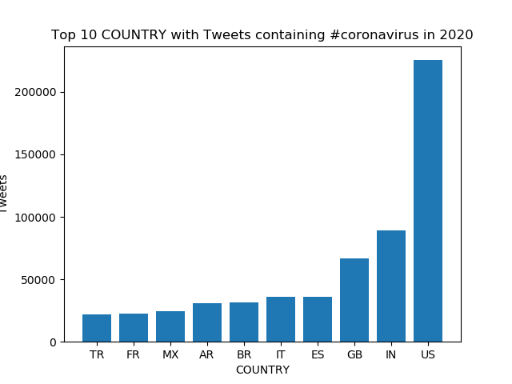
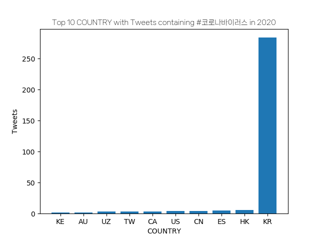
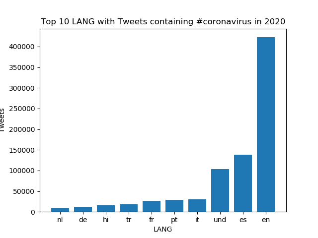
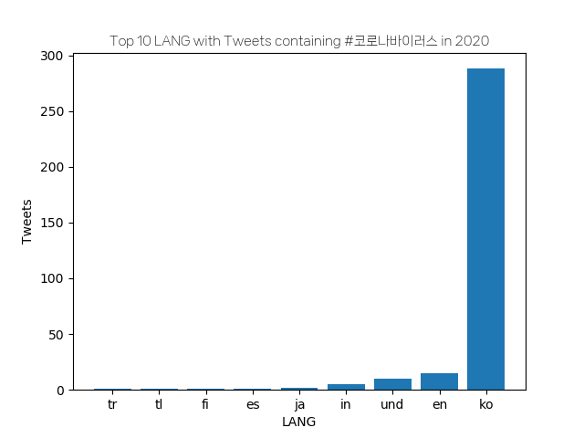
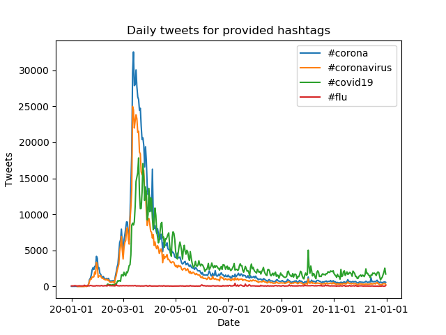
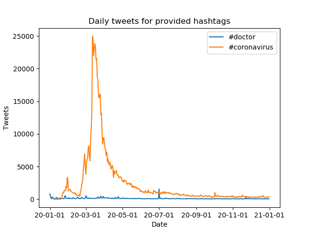
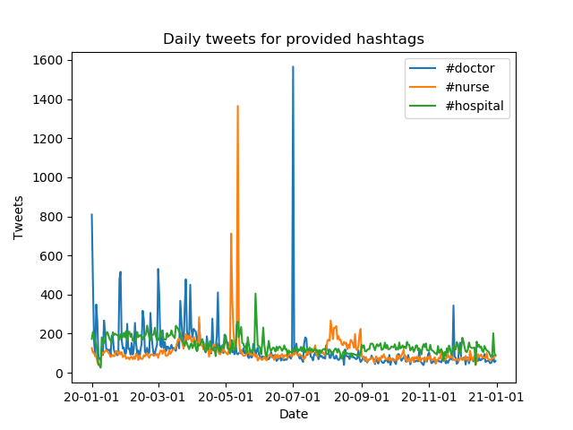
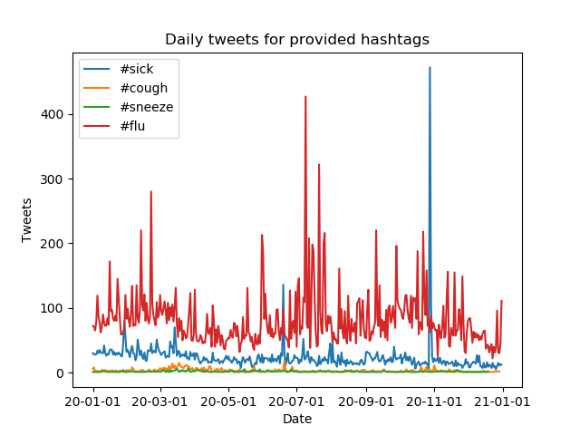

# Analysing 2020 Tweets for Coronavirus

In this repository, we perform data analysis on geotagged tweets in 2020 to monitor the spread of covid-19. The biggest challenges from this project were learning to work with large datasets (1.1 billion tweets) and writing parallel code to optimize scripts. 

## Tweet Data

The tweets were stored in the format `geoTwitterYY-MM-DD.zip` indicating that we had a single `.zip` file for each day. Within each file, there were 24 files containing the tweets for each hour in the day. 

## Methods

As mentioned previously, writing parallel code was essential to processing the data. Hence, we used the **MapReduce** procedure in order to categorize the tweets depicted below: 


In the `src/map.py` file, we process an individual zip file of the above format (a day's tweets) and process it to categorize the tweets from that day by their hashtags, and subcategorize them by their country and language. For example, running `src/map.py` on `geoTwitter20-01-01.zip` and would have the following output if subcategorized by country (the complete output is omitted for brevity):
```
{
    "_all": {
        "US": 17561323,
        "ZW": 29274,
        "CO": 783258,
        "IT": 516817,
        "GB": 3512795,
        "NOCOUNTRY": 123488,
        ...
    },
    "#flu": {
        "ID": 1,
        "BR": 7,
        "CO": 2,
        ...
    },
    "#doctor": {
        "GB": 622,
        "US": 80,
        "BR": 20,
        ...
    },
    "#hospital": {
        "US": 139,
        "CA": 12,
        "JP": 2,
        ...
    },
    "#corona": {
        "BR": 4,
        "MX": 3,
        "CO": 2,
        ...
    },
    "#cough": {
        "GB": 2,
        "US": 4
    },
    "#nurse": {
        "GB": 20,
        "ZA": 1,
        "US": 87,
        ...
    },
    "#sick": {
        "GB": 5,
        "US": 23,
        "IN": 1,
        ...
    },
    "#virus": {
        "IN": 4,
        "MX": 1
    },
    "#sneeze": {
        "US": 1
    }
}
```
The `shell/run_maps.sh` script allows us to run `src/map.py` on all the files in the dataset from the year 2020 in parallel, also utilizing the `nohup` command to run in the background. This script generates two new files for each day, one subcategorized by country and the other by language. 

Next, the `src/reduce.py` file combines all the subcategorized "country" files into one and all the subcategorized "country" files into another one to have two files summarizing the data. Finally, the `src/visualize.py` file generates bar graphs of this data given a hashtag to display the number of tweets containing the provided hashtag by each country or language. 

The `src/alternative_reduce.py` file takes multiple hashtags as an input, and outputs a line graph for each hashtag indicating the number of tweets containing that hashtag throughout the year. 

## Results

We now show some of our generated results and graphs from our processed data.

### Bar Graphs

#### Top Countries with Tweets containing "#coronavirus"


We can see that the most tweets are from the US and India.

#### Top Countries with Tweets containing "#코로나바이러스"


Unsurprisingly, the most tweets are from Korea as the hashtag is in Korean.

#### Top Languages with Tweets containing "#coronavirus"


We see that most tweets are in English, followed by Spanish.

#### Top Languages with Tweets containing "#코로나바이러스"


Similar to the second graph, it makes sense that most of the tweets are in Korean since the hashtag is a Korean word.

### Line Graphs

#### Popularity of #corona, #coronavirus, #covid19 and #flu across 2020


We can clearly see a peak in around March and April for all the covid hashtags, while flu remained relatively flat in comparison. 

#### Popularity of #doctor and #coronavirus across 2020


Similar graph for `#coronavirus` as above, and `#doctor` remains relatively flat in comparison. 

#### Popularity of #doctor, #nurse and #hospital across 2020


`#doctor` has a large peak in July, a smaller peak in January, and remains high at the start of the year. `#nurse` has a peak in May-June but along with `#hospital` is relatively flat, though there is minor peak in around June for `#hospital`.

#### Popularity of #sick, #cough, #sneeze and #flu across 2020


`#sick` peaks in around November and `#flu` seems to peak in around July-August. Both `#sneeze` and `#flu` are relatively flat in comparison.
